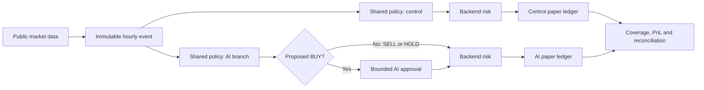

# Quant V2: controlled forward paper comparison

V1 could stop the control when the AI failed, and the two branches had different
position sizing and exits. V2 compares a fixed rule with the **same rule plus an
AI entry veto**, starting two new $50 paper portfolios. V1 balances, databases,
states and reports remain separate. No historical fill is replayed into V2.



## Policy and comparison

- BTCUSDT and ETHUSDT spot; one action per UTC hour per portfolio.
- BUY $5 when quote > SMA20 > SMA50 and closed-candle 24-hour return > 0.
  No adding; BTC wins entry ties. Cash includes the 0.1% fee, exposure <= $20.
- SELL when quote < SMA20 and 24-hour return < 0, or when daily/total-equity
  loss protection is reached. Exits take priority over entries, BTC first.
  Continue partial liquidation in <= $5 steps even if the trend recovers.
- The AI can approve/veto the single proposed BUY. It cannot change its symbol,
  amount, or risk rules, and is never called for SELL or HOLD. A veto ends that
  hour's action; it does not cause the engine to try the other coin.
- A failed/malformed/timed-out vote becomes `AI_UNAVAILABLE` HOLD if the event
  is still fresh. Otherwise the hour is missing. Both are distinguishable from
  an intentional veto. Neither blocks the control branch or future reducing sells.
- Both consumers use identical cached input and execution quotes. This removes
  price differences caused by model latency **in this simulation only**. Prices
  are not claims of executable live fills; spread, slippage and AI/VPS costs are
  excluded. Account inventories can diverge after the first veto.
- Sub-microdollar inventory stays in the ledger and valuation. It does not block
  a new entry. Deterministic `confidence=1` is schema metadata, not a probability.

`runner/policy.py` is pure and shared by both forward branches. It can be called
by replay/research adapters. The existing `quant/backtest.py` is still the V1
research proxy with its own execution assumptions; do not label its historical
results as V2 or as AI results. Connecting a historical replay adapter, spread/
slippage calibration and out-of-sample strategy selection remain research work.

## Risk and accounting

`RISK_POLICY=reduce-only-v2` is an explicit backend setting; the default stays
`legacy-v1` for historical clients. The new consumers refuse a legacy backend.

- Realized loss <= -$3 for the current UTC day blocks BUY. Valid reducing SELL
  remains available, with the same $5 cap and no shorting/overselling.
- Marked equity at/below initial capital minus $3 also blocks BUY, **including
  its proposed entry fee**. For $50 initial capital the floor is $47. This is an
  absolute loss budget, not drawdown from a rolling peak and not a daily reset.
- The policy initiates gradual liquidation on either loss breach. Hourly
  observation, gaps, fees and the per-order cap can take losses beyond $3;
  this is not a guaranteed stop price or maximum realized loss.
- V2 orders require an existing context with the current portfolio version,
  both quote timestamps < 240s old, the same UTC risk day, and a matching order
  price. Risk valuation uses both saved context marks, not the other coin's old
  fill. The backend recomputes equity from its own cash/positions.
- Signals are serialized; trades, accounting, decision audit and idempotency
  receipt commit atomically. Replay returns the original receipt even when its
  context is now stale. An unknown expired runner request blocks new work until
  reconciled; never delete pending state or issue a replacement key.

This remains a manual-price paper API. Input quote timestamps establish freshness
inside the experiment, not exchange authentication. It is not a live trading risk
gateway. A reachable token-free endpoint can still accept manual submissions;
the paired experiment assumes its consumers are the only writers.

## Events, scheduling and versions

`market_snapshot.py` runs at minute 02:00 and retries at 02:30. Each UTC slot gets
one atomically published JSON file with a SHA-256 ID. A retry does not replace it.
Indicators use 100 contiguous **closed** hourly candles and are recomputed by
consumers; stale data, gaps, mismatched clocks or checksums block submission.

AI and control timers both attempt at 02:15, 02:45, 03:15 and 03:45. There is no
dependency between them. A running systemd oneshot is not started again; file
locks also prevent concurrent consumers. Completed slots skip; pending slots
recover their exact durable body/key. Neither replays missed market hours.

Codex votes have a maximum 150s timeout, shortened to leave delivery time within
the 240s event lifetime. The CLI uses the existing dedicated user's ChatGPT
login, read-only mode, no shell and no web, with a JSON output schema. See the
[official non-interactive documentation](https://learn.chatgpt.com/docs/non-interactive-mode).
The configured model is inherited; its runtime model identity is recorded in
each vote's CLI log. The manifest pins code/prompt/schema hashes, not provider
model weights. Model changes therefore need review and a new experiment segment.

`experiment.json` pins code, prompt/schema, policy, backend URLs and opening
contexts. Initialization requires separate fresh accounts and starts at the
**next** hourly slot. Code changes stop new decisions rather than silently mixing
versions. Python source and all backend TypeScript files enter the hash, with
line endings normalized. Recovery of a pending request precedes the hash check.

## Run and inspect

Templates in `deploy/ubuntu/ai-paper-v2-*` expect `/opt/ai-paper-trader`, the existing
`trade-agent` and `paper-trader` users, and separate backend state directories:

| Component | Location |
| --- | --- |
| AI backend | port 3000, `/var/lib/ai-paper-v2-ai/paper.sqlite` |
| Control backend | loopback port 3001, `/var/lib/ai-paper-v2-control/paper.sqlite` |
| Config | `/etc/ai-paper-v2-ai.env`, `/etc/ai-paper-v2-control.env` |
| Manifest | `/home/trade-agent/paper-v2/experiment.json` |
| Market events | `/home/trade-agent/paper-v2/market/<UTC-slot>.json` |
| Consumer states | `/home/trade-agent/paper-v2/{ai,control}/state.json` |
| Per-run evidence | respective `runs/` directory: context, proposal, vote, payload, request, result |

Before switching, pause V1 timers, verify no running agent or unresolved request,
and take consistent SQLite backups plus source/state/unit copies. Stop old
backends before binding their ports. Do not delete/reset either old database.
Install the v2 environment and unit files, create the agent directories, start
both v2 backends, then run initialization as `trade-agent`. Enable all three v2
timers only after confirming the manifest, policy, account isolation and health.

```sh
runuser -u trade-agent -- python3 -B /opt/ai-paper-trader/runner/paired.py --initialize
systemctl enable --now ai-paper-v2-market.timer ai-paper-v2-agent@ai.timer ai-paper-v2-agent@control.timer
runuser -u trade-agent -- python3 -B /opt/ai-paper-trader/runner/paired_report.py --output /home/trade-agent/paper-v2/latest-report.json
python3 -B /opt/ai-paper-trader/runner/reconcile.py /var/lib/ai-paper-v2-ai/paper.sqlite
python3 -B /opt/ai-paper-trader/runner/reconcile.py /var/lib/ai-paper-v2-control/paper.sqlite
```

The report contains net equity/returns, fees, sampled drawdown, fills, coverage,
missing market hours, pending requests, AI votes/errors and quote-to-fill latency.
Reconciliation reads the **entire** SQLite ledger, checking cash, quantities,
fees, realized PnL, trade/decision/version counts and database integrity. It also
counts completed round trips (exit below $0.000001 at the exit quote).

Review after 14 calendar days, together with completed round trips and coverage.
No fixed trade count, automatic promotion, forced entry or promise of profit.
Report zero trades honestly when no rule qualifies.

To roll back: stop/disable all v2 timers; reconcile any pending request; stop v2
backends; restore the backed-up V1 release and original units; then restart V1
backends/timers with their original database and state paths. Keep V2 data intact
and record the resumed V1 epoch. Never run both generations against one database.

## Verification

```sh
pnpm test
pnpm typecheck
pnpm lint
pnpm build
python3 -B -m unittest discover -s runner -p 'test_*.py'
python3 -B runner/paired_smoke.py --project .
```

The disposable smoke uses two real HTTP servers and separate SQLite files, a
synthetic market event and an injected AI outage. It verifies control independence,
dry runs, isolation, forward-only startup, restart/replay deduplication, reporting
and ledger reconciliation. Synthetic evidence never enters deployed portfolios.
